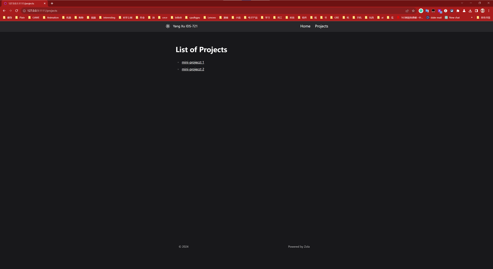

# ids721-mini1

## install zola in Ubuntu system

go to zola website and download a version compressed package from the github page: https://github.com/getzola/zola/releases
for me I use this version package: `zola-v0.18.0-x86_64-unknown-linux-gnu.tar.gz`

unzip: `tar -xzf zola-v0.18.0-x86_64-unknown-linux-gnu.tar.gz`
Move Zola to the bin Directory: `sudo mv zola /usr/local/bin`
if you want to get more information you can go to Zola offical web doc page: https://www.getzola.org/documentation/getting-started/installation/

## inital and run zola serve
- intial the project 
    `zola init project_name`
- build your project
    `zola build`
- run your project serve, the default port is 1111
    `zola serve`

## theme install
Download the themes you want to your themes directory. Then, you need to tell Zola to use it by setting the `theme` variable in the configuration file. The theme name has to be the name of the directory you cloned the theme in. For example, I cloned the theme in `themes/kita`, the theme name to use in the configuration file is kita. Also make sure to place the variable in the top level of the `.toml` hierarchy and not after a dict like `[extra]` or `[markdown]`. Some themes require additional configuration before they can work properly. Be sure to follow the instructions found on your chosen theme's documentation to properly configure the theme.

## theme use and modify
- if we want to use the theme, we need to add `extends` code in our template html file, and change the block to fit the theme index. And if you need to modify something, we can copy the index code to our own `index.html` template or change the code in theme file you want to modify. And if you did not add the `extends` code in your own code or copy the code from theme into your own file, the theme will not take effect and render for your project.
- for the `config.toml` file, if you want to use the theme, please copy the `config.toml` file or all its code into your config.toml file in the root directory. Then, check the config codes in your config.toml, and modify them for your own project, you can add extra option config for your own project, and you also can modify or delete the original code you copied from the theme for your own config you need. You can modify config.toml to customize your index template.

## My page
On the header of the page template, there are buttons to jump to each other between the Home and Projects list pages. You can use these two buttons to jump to any page on this website.

### home page
This is my web Home page. A brief description of the content of the ids-721 course I took.

### projects list page
This is the portfolio page of my projects. It lists all my IDS-721 course projects.

### project detail page
This is my project details page. It has details of the currently selected item. On this page, you can jump to the git repo of the current project through the `mini-project x Git Repo Link` hyperlink. You can also click the `Back` button to return to the previous project overview list page.

## deploy