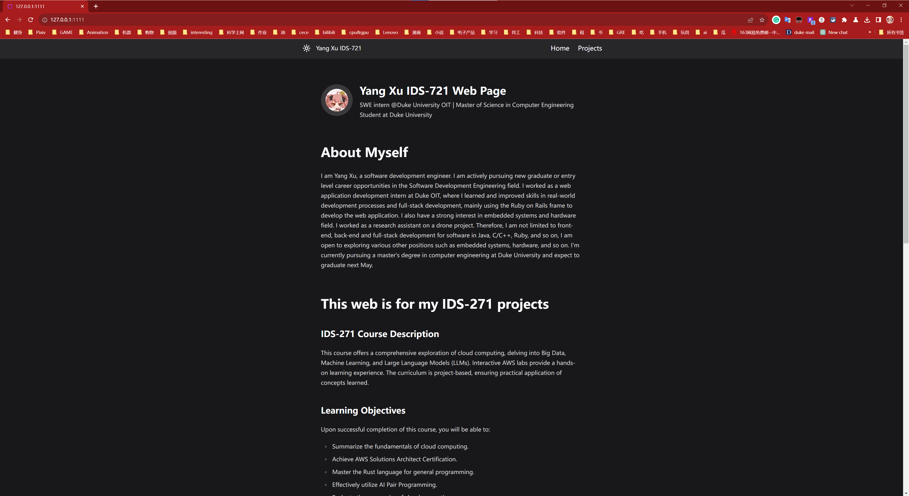

# ids721-mini1

## Installation of Zola on Ubuntu

1. Download Zola from the [official releases page](https://github.com/getzola/zola/releases). For example, use `zola-v0.18.0-x86_64-unknown-linux-gnu.tar.gz`.

2. Unzip the package:
```tar -xzf zola-v0.18.0-x86_64-unknown-linux-gnu.tar.gz```

3. Move Zola to the bin directory:
```sudo mv zola /usr/local/bin```
For more information, refer to the [Zola Official Documentation](https://www.getzola.org/documentation/getting-started/installation/).


## Initial Setup and Running Zola Server

- Initialize the project: 
    ```zola init project_name```

- Build the project:
    ```zola build```

- - Run the server (default port is 1111):
   ```zola serve```


## Theme Installation

1. Download your chosen theme to the `themes` directory.

2. Update the `theme` variable in the configuration file to match the name of your theme's directory (e.g., `themes/kita`).

 **Note:** Ensure the `theme` variable is at the top level of the `.toml` hierarchy, not nested under sections like `[extra]` or `[markdown]`.

3. Follow any additional configuration instructions provided in your theme's documentation.

## Theme Usage and Customization

- To use a theme, add the `extends` directive in your template HTML files. Modify the blocks to fit the theme's index.

- For further customization, you can either:
- Copy the index code from the theme to your `index.html` file, or
- Modify the theme files directly.

- Update the `config.toml` file in your project's root directory with the theme's `config.toml` settings. Customize these settings to suit your project's needs.


## Website Structure

In the header of the page template, you'll find `Home` and `Projects` buttons that enable easy navigation between the Home page and the Projects List page, allowing quick access to any section of the website.

### Home Page

- Overview of the IDS-721 course content.
- 

### Projects List Page

- Portfolio of IDS-721 course projects.
- 

### Project Detail Page

- Detailed view of a selected project.
- Direct links to the corresponding Git repository.
- Back button to return to the project overview list.
- 


## deploy